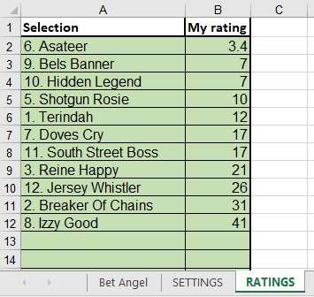
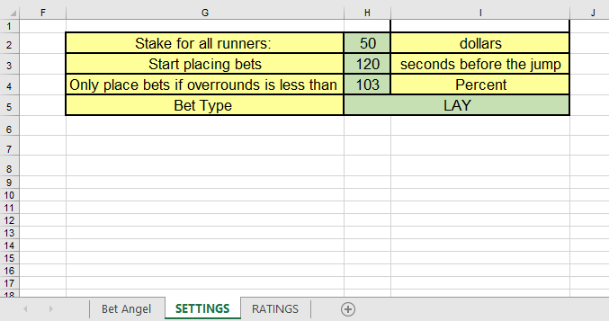
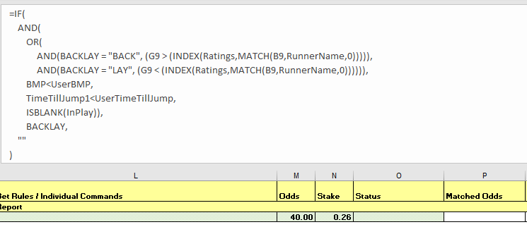
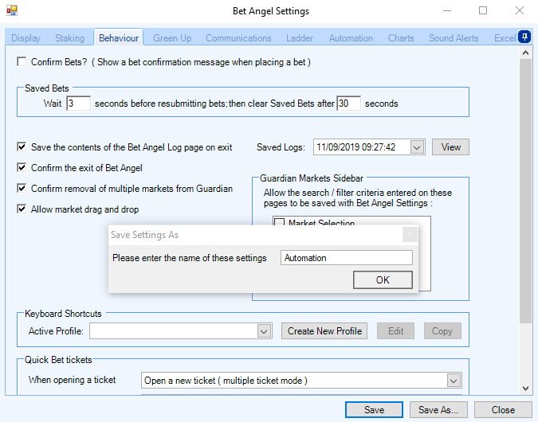

# Bet Angel: Multiple market ratings


---
## Automating a ratings based strategy across multiple markets using Bet Angel Pro with some help from BetSmart

Using ratings from reputable sources such as BetSmart can be a great way to increase your wagering IQ. In this tutorial, we'll be following a similar process to some of our other Betfair automation tutorials, but here we'll be using the ratings provided by BetSmart and incorporate them into our automation in Bet Angel. We've also made changes to the spreadsheet to allow you to automate three simultaneous markets. This will allow you to be confident that you won't miss a market due to delays or other unforseen events.  

Bet Angel Pro has a spreadsheet functionality that lets you place bets using your own variables and information from the live market, which is what we've used here to automate these ratings. There are so many different ways to use this part of Bet Angel and we're very open to any thoughts about more effective ways of implementing this sort of strategy. You're welcome to reach out to us on automation@betfair.com.au with your feedback and opinions. 

--- 
## Increasing Wagering IQ through BetSmart Ratings
###- The plan

We're using the [BetSmart Ratings Model](https://www.betfair.com.au/hub/betsmart-ratings/) which is led by pro punter, Daniel O’Sullivan. BetSmart specializes in ratings for VIC and NSW markets and are [shared on our Hub](https://www.betfair.com.au/hub/betsmart-ratings/). Bet Angel Pro's 'Guardian' feature has the capacity to let you create spreadsheets with pretty complicated rules that can be applied to multiple markets, which is what we've used for the automation here, incorporating BetSmart ratings into the auotmation. 

We'll step through how we went about getting Bet Angel Pro to place bets using the [ratings from BetSmart](https://www.betfair.com.au/hub/betsmart-ratings/). Once it's set up the goal is to be able to upload a new set of ratings, choose your races, set the program running and be able to walk away. You'll also be able to use this approach to automate using your own ratings. 


!!! info "Resources"
    - Ratings: [BetSmart Ratings](https://www.betfair.com.au/hub/betsmart-ratings/)
    - Rules: [here's the spreadsheet](./assets/BetAngel_MultipleMarketRatings.xls) We set up with our macros and rules included, but you'll obviously need to tweak it to suit your strategy and the format of your ratings 
    - Tool: [Bet Angel Pro](https://www.betangel.com/bet-angel-professional/)
    - Additional info: [BetSmart web page](https://betsmart.racing/)
    - Assigning multiple markets to your Excel worksheets in Bet Angel so you dont miss a race: [Betfair automating simultaneous markets tutorial](/thirdPartyTools/betAngelSimultaneousMarkets/)

---
###- Set up 

Make sure you've downloaded and installed Bet Angel Pro, and signed in.

Once you open the program up click on the 'G' Guardian icon and open the Guardian functionality up. 


---
###- Finding & formatting ratings

Here we're using the [ratings shared by BetSmart on the Hub](https://www.betfair.com.au/hub/betsmart-ratings/). This makes for a bit of prep work, copying the list of runners and their rating into an Excel spreadsheet. As a minimum you'll need a list of runner names (including the runner number followed by a full stop, i.e. 1. Runner Name) in one column and their rating in another in an Excel sheet. 

If you have a list of ratings already in a spreadsheet that's even better - you'll be able to tweak the Excel formulas to work with whatever format your data is in.

Wherever your ratings come from, you'll need to include them in the spreadsheet you're using to interact with Bet Angel. Here we're using an Excel [spreadsheet we edited for this strategy](./assets/BetAngel_MultipleMarketRatings.xls), and we've included a tab called RATINGS where you can copy in the runner names and ratings.



---
###- Writing your rules

As with any automated strategy, one of the most important steps is deciding what logical approach you want to take, and writing rules that suit. 

We're using an [customised Bet Angel template Excel sheet](./assets/BetAngel_MultipleMarketRatings.xls) to implement our strategy, so it can make betting decisions based on our BetSmart ratings and automate on multiple markets. Excel is an excellent tool, but it can take an investment of time to be able to use it effectively. 

This is how we used Excel to implement our set of rules. 


###- Trigger to place bet

In short, we want to back runners when:

- the available to back price is better than the rating for that runner
- the scheduled event start time is less than a certain number of seconds that we choose
- the event isn't in play 
- back market percentage is less than a certain value that we choose

###- Using cell references to simplify formulas

Throughout this tutorial, we'll be referencing certain cells with custom names that will make it easier to understand and follow the formulas as we progress. This is an especially effective method to
keep on top of more complex strategies that require long formaulas to implement.
 
!!! info "Cell names used in this tutorial"
     - **Rating** refers to the entire Column B in the RATINGS work sheet

     - **RunnerName** refers to the entire column A in the RATINGS work sheet

     - **BMP** refers to cell AF8 in the Bet Angel work sheet where the overrounds are calculated

     - **UserBMP** refers to cell H4 in the SETTINGS work sheet which allows you to change a single value that will automatically update the formulas for all runners

     - **TimeTillJump** refers to cell E4 in the SETTINGS work sheet

     - **UserTimeTillJump** refers to cell H3 in the SETTINGS work sheet which allows you to change a single value that will automatically update the formulas for all runners

     - **InPlay** refers to cell G1 in the Bet Angel work sheet. Bet Angel will populate a status in this cell such as "In Play" or "Suspended"

     - **BACKLAY** refers to cell H5 in the SETTINGS work sheet which allows you to easily switch between Back and Lay bet typers via a drop down box and will automatically update the formulas for all runners
    
    


**This is our trigger on Excel formula:**

``` excel tab="Multi line"
=IF(
    AND(
        OR(
             AND(BACKLAY="BACK",(G9>(INDEX(Ratings,MATCH(B9,RunnerName,0))))),
             AND(BACKLAY="LAY",(G9<(INDEX(Ratings,MATCH(B9,RunnerName,0)))))),
        BMP<UserBMP,
        TimeTillJump1<UserTimeTillJump,
        ISBLANK(InPlay)),
        BACKLAY,
    ""
)
```

``` excel tab="Single line"
=IF(AND(OR(AND(BACKLAY = "BACK", (G9 > (INDEX(Ratings,MATCH(B9,RunnerName,0))))),AND(BACKLAY = "LAY", (G9 < (INDEX(Ratings,MATCH(B9,RunnerName,0)))))),BMP<UserBMP,TimeTillJump1<UserTimeTillJump,ISBLANK(InPlay)),BACKLAY,"")
```

Stepping through each step:

- **Chcking market odds based on back or lay bet type:** Here we're checking which bet type we've chosen from the dropdown box in the SETTINGS worksheet. If a BACK bet has been selected, the best available back bet must greater than our ratings that have been defined for that particular runner in the RATINGS worksheet. On the flip side, if a LAY bet has been selected, then the best available back bet must be less than our ratings.

``` excel hl_lines="4 5"
=IF(
    AND(
        OR(
             AND(BACKLAY="BACK",(G9>(INDEX(Ratings,MATCH(B9,RunnerName,0))))),
             AND(BACKLAY="LAY",(G9<(INDEX(Ratings,MATCH(B9,RunnerName,0)))))),
        BMP<UserBMP,
        TimeTillJump1<UserTimeTillJump,
        ISBLANK(InPlay)),
        BACKLAY,
    ""
)
```

- **Back market percentage (BMP) is less than what we define:** Here we're making a calculation for each runner (100 / best back price) and then calculating the sum of all of the runners together to give us the back market percentage. As the closer the BMP is to 100%, the fairer the market is, we use this to ensure that we only place bets when the market is less than what we define in the SETTINGS worksheet. [Additional information relating to over-rounds can be found on the Hub.](https://www.betfair.com.au/hub/understanding-over-round/)

``` excel hl_lines="6"
=IF(
    AND(
        OR(
             AND(BACKLAY="BACK",(G9>(INDEX(Ratings,MATCH(B9,RunnerName,0))))),
             AND(BACKLAY="LAY",(G9<(INDEX(Ratings,MATCH(B9,RunnerName,0)))))),
        BMP<UserBMP,
        TimeTillJump1<UserTimeTillJump,
        ISBLANK(InPlay)),
        BACKLAY,
    ""
)
```


- **Time until the jump is less than what we define:** Check whether the seconds left on the countdown are smaller than 120 (2 minutes), as the majority of markets don't fully form until the last few minutes before the off. This one's a bit complicated, as the time is actually returned as a percentage of a 24 hour day, which you need to convert into positive or negative seconds. [You can read about the formula here](https://www.betangel.com/forum/viewtopic.php?t=7657) or just keep it simple by referencing the value in cell E2 of the SETTINGS sheet (TimeTillJump1), where we've already done the calculations for you. 

``` excel hl_lines="7"
=IF(
    AND(
        OR(
             AND(BACKLAY="BACK",(G9>(INDEX(Ratings,MATCH(B9,RunnerName,0))))),
             AND(BACKLAY="LAY",(G9<(INDEX(Ratings,MATCH(B9,RunnerName,0)))))),
        BMP<UserBMP,
        TimeTillJump1<UserTimeTillJump,
        ISBLANK(InPlay)),
        BACKLAY,
    ""
)
```

!!! info "Calculating the time until the jump for multiple markets at the same time"

    One thing to be aware of here is that because we're wanting to follow up to three markets in our excel workbook, we need to have three instances of the time conversion formula - One for each possible market that we may want to link into our Excel file. These formulas are located in the SETTINGS worksheet on columns C, D and E which have been hidden as to not over complicate this tutorial. 
    
    In the 'Bet Angel' worksheet, the formulas will be written ```TimeTillJump1<UserTimeTillJump,``` while in the Bet Angel 2 and Bet Angel 3 worksheets it will be written ```TimeTillJump2<UserTimeTillJump,``` and ```TimeTillJump3<UserTimeTillJump,``` respectively. This will mean that every 'Bet Angel' worksheet will display and track the correct time till jump for their own applicable market.  


- **Not in play:** checking whether the event has gone in play - as odds change so much in the run we only want to use this strategy pre-play. If this cell is blank it means it's not displaying the 'in-play' flag, so it's safe to place bets. 

``` excel hl_lines="8"
=IF(
    AND(
        OR(
             AND(BACKLAY="BACK",(G9>(INDEX(Ratings,MATCH(B9,RunnerName,0))))),
             AND(BACKLAY="LAY",(G9<(INDEX(Ratings,MATCH(B9,RunnerName,0)))))),
        BMP<UserBMP,
        TimeTillJump1<UserTimeTillJump,
        ISBLANK(InPlay)),
        BACKLAY,
    ""
)
```

- **Result:** if the statement above is true, the formula returns either a "BACK" or "LAY" depending on what has been selected from the SETTINGS worksheet, at which point the bet will trigger, otherwise the cell will remain blank and no bet will be placed.

``` excel hl_lines="9 10"
=IF(
    AND(
        OR(
             AND(BACKLAY="BACK",(G9>(INDEX(Ratings,MATCH(B9,RunnerName,0))))),
             AND(BACKLAY="LAY",(G9<(INDEX(Ratings,MATCH(B9,RunnerName,0)))))),
        BMP<UserBMP,
        TimeTillJump1<UserTimeTillJump,
        ISBLANK(InPlay)),
        BACKLAY,
    ""
)
```

!!! info "Excel functions"

    - [IF statement:](https://support.office.com/en-us/article/if-function-69aed7c9-4e8a-4755-a9bc-aa8bbff73be2) IF(if this is true, do this, else do this)
    - [AND statement:](https://support.office.com/en-us/article/and-function-5f19b2e8-e1df-4408-897a-ce285a19e9d9) AND(this is true, and so is this, and so is this) - returns true or false
    - [And Or statement:](https://support.office.com/en-us/article/use-and-and-or-to-test-a-combination-of-conditions-e1ed88d7-1de3-4422-ae41-45291a69f9e1) checks that the statement meets more than one condition. If this OR that, then do the following. 
    - [VLOOKUP:](https://support.office.com/en-us/article/vlookup-function-0bbc8083-26fe-4963-8ab8-93a18ad188a1) looking up a value from a table based on the value you pass in
    - [Absolute references:](https://support.office.com/en-us/article/switch-between-relative-absolute-and-mixed-references-dfec08cd-ae65-4f56-839e-5f0d8d0baca9) if you're copy/pasting formulas it's important that you make links absolute when you don't want the cell being referenced to change relative to the new cell the formula is being pasted into. You do this by putting a $ in front of the parts of the reference you don't want to 'move'. 

---
###- Preparing the spreadsheet

You need to copy/paste this formula into the relevant cell on each green row - we copied ours into all of the coloured cells in the sheet, just in case the fields are bigger in future events such as the Melbourne Cup. Excel is clever enough to automatically update the relative links in the formulas, so you should be able to copy/paste the same formula into each cell as long as you've got your [relative and absolute references straight](https://support.office.com/en-us/article/switch-between-relative-absolute-and-mixed-references-dfec08cd-ae65-4f56-839e-5f0d8d0baca9). 

- **Trigger bet rule:** this is the bet trigger Excel formula we created earlier, and it needs to go in column L (L9 for the first runner).

``` excel tab="Multi line"
=IF(
    AND(
        OR(
             AND(BACKLAY="BACK",(G9>(INDEX(Ratings,MATCH(B9,RunnerName,0))))),
             AND(BACKLAY="LAY",(G9<(INDEX(Ratings,MATCH(B9,RunnerName,0)))))),
        BMP<UserBMP,
        TimeTillJump1<UserTimeTillJump,
        ISBLANK(InPlay)),
        BACKLAY,
    ""
)
```

``` excel tab="Single line"
=IF(AND(OR(AND(BACKLAY="BACK",(G9>(INDEX(Ratings,MATCH(B9,RunnerName,0))))),AND(BACKLAY="LAY",(G9<(INDEX(Ratings,MATCH(B9,RunnerName,0)))))),BMP<UserBMP,TimeTillJump1<UserTimeTillJump,ISBLANK(InPlay)),BACKLAY,"")
```



- **Odds:** initially we were using the runner's rating as the price, but we got a bet placement error for some of the selections - eventually we realised that the odds the bet's being placed at need to be [valid Betfair 'ticks'](https://docs.developer.betfair.com/display/1smk3cen4v3lu3yomq5qye0ni/placeOrders#placeOrders-BetfairPriceIncrements). For simplicity's sake we're now just using the currently available back odds (cell G9 for the first runner). This goes in column M (M9 for the first runner). Another option would be to create a look up table that rounded your rating to the nearest ['tick' price](https://docs.developer.betfair.com/display/1smk3cen4v3lu3yomq5qye0ni/placeOrders#placeOrders-BetfairPriceIncrements) - if you do this, please do [send us](mailto:bdp@betfair.com.au) through your formula and we'll add it to this tutorial.

```=G9```


- **Stake:** It's completely up to you what staking approach you want to take. We've kept it simple, and are just using a 'to win / to lose' strategy. Each bet aims to win whatever value has been entered in the SETTINGS worksheet on that runner at the current odds if the bet type has been set to BACK. If the bet type has been changed to LAY, then the stake becomes the liability - again, easily changed in the SETTINGS worksheet. 

The formula is referencing cell H2 in the SETTINGS worksheet where we can easily update all the formulas by changing this single value. It divides $10 by the current available best back odds (cell G9 for the first runner) minus one to get the stake required to win $10. This goes in column N (N9 for the first runner). We've got some [good resources on the Hub](https://www.betfair.com.au/hub/better-betting/betting-principles/basic-principles/staking-plans-and-strategies/) that look at different staking approaches - these might be useful in helping you decide which strategy you want to use. 

```=stake/(G9-1)```


---

##- Connecting to Bet Angel

###- Selecting markets

We used the markets menu in the 'Guardian' tool to navigate to Australian tracks that BetSmart have provided ratings for, then multi-selected all the win markets by holding down the control key and clicking on the different markets.

Once you've chosen the races you're interested in click the 'add' button and you'll see them appear in the main body of the screen. 

Make sure you sort the races **by start time**, so Bet Angel will automatically move through them in the right order and allocate the next race to the spreadsheet once the previous one ends. 

You do this by clicking on the 'start time' column heading until the races are in time order (when the arrow is pointing up). Below is an example of doing this on Australian markets.


The Excel spreadsheet used in this tutorial is created in a way that allows it to link multiple markets at the same time. Take a look at the [Betfair automating simultaneous markets tutorial](/thirdPartyTools/betAngelSimultaneousMarkets/) on the hub which will step you through the process so you can take advantage of this feature. 

---
###- Linking the spreadsheet

Open the 'Excel' tab in 'Guardian', then use the browse functionality to choose the spreadsheet you've been working on. From there, click on 'open workbook', then make sure you have 'connect', 'auto-bind Bet Angel sheets and 'auto-clear Bet Angel bindings' all selected. You also need to make sure that the first race has the 'Bet Angel' tab selected in the 'Excel sheet' column - from there it will then automatically update this for each race as one finishes and the next one begins. 


---
## And you're set!

Once you've set your spreadsheet set up and you're comfortable using Bet Angel Pro it should only take a number of seconds to load your markets and ratings up and set your strategy running for the day. Just make sure you have all of the app settings correctly selected before you leave the bot to run, as some of them reset by default when you turn the program off.

!!! info "Note:" 
    You will need to leave your computer up and running for the duration of the chosen markets, as the program needs the computer to be 'awake' to be able to run.

---
## Bet Angel features

Here are some Bet Angel features that you'll need to consider.

###- Multiple bets/clearing status cells
The Bet Angel spreadsheet won't let a bet go on if there is a value in column 0 for the runner, the 'status' column, to avoid accidentally placing multiple bets unintentionally. As soon as a bet triggers, Bet Angel automatically changes this cell to 'PLACING', then to 'PLACED' when the bet is confirmed as having been received by Betfair. In this strategy we only want to place one bet per runner, but if you wanted to place multiple bets on a runner you'd need to have a play with the macros to clear the 'status' cells more regularly, and instead reference the number of bets placed/matched in columns T:AE. Careful here though, as the values in these columns sometimes take a little time to update, and we've had more bets go on than we intended when using these cells as our check, as bet trigger re-evaluated before columns T:AE had updated. 

As we want to use each worksheet over and over again for multiple races, and the 'status' cells don't clear automatically, we've created a macro in [the Excel sheet](./assets/BetAngel_MultipleMarketRatings.xls) that auto-clears the status cells whenever a new race loads. It also clears the cells if they say 'FAILED', as we found that if there were internet network issues or similar it would fail once then not try to place the bet again. This was based on some logic we found in [a forum discussion on Bet Angel](https://www.betangel.com/forum/viewtopic.php?f=31&t=1879&start=10). If you're feeling adventurous you can have a play with the macros and edit them to suit your specific needs. 

###- Turning off bet confirmation
Unless you want to manually confirm each individual bet you're placing (which you definitely might want to do until you feel comfortable that the program and strategy are behaving as you expect) you'll need to go into the 'Settings' tab on the main Bet Angel Pro program, click 'Edit settings', go to the 'Behaviour' tab, and remove the tick at the top next to 'Confirm Bets?' - you can then save these settings. Bet Angel allows you to save different settings configurations as profiles. Depending what you are wanting to use Bet Angel for each time you open it up, you can select the appropriate setting profile to suit your needs without having to go through and change them every time. 



###- Editing the spreadsheet
The spreadsheet really doesn't like it when you try and edit it 'live', so make sure you untick 'connect' on the Excel tab in Guardian before you make any changes, save the sheet, then tick 'connect' again once you've finished your edits. 

---
## Areas for improvement

There are parts of this approach that we're still trying to get to work to our liking, and we'll update this article as we find better solutions. If you have any suggestions for improvements please reach out to automation@betfair.com.au - we'd love to hear your thoughts. 

---
## What next? 

We're working through some of the popular automation tools and creating articles like this one to help you learn how to use them to implement different styles of strategies. If you have any thoughts or feedback on this article or other programs you'd like to see us explore please reach out to automation@betfair.com.au - this article has already been updated with extra learnings including variable percentages and new macros.

---
## Disclaimer

Note that whilst automated strategies are fun and rewarding to create, we can't promise that your betting strategy will be profitable. If you're implementing your own strategies please gamble responsibly and note that you are responsible for any winnings/losses incurred.