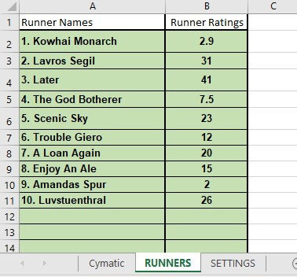
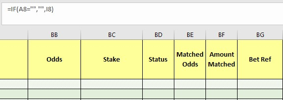
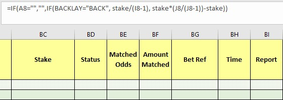

# Cymatic Trader: Ratings automation

---
## Automating a ratings based strategy using Cymatic Trader   

Ratings are the basis for a lot of betting strategies, but they can be particularly painful and time-consuming to implement manually. This makes them ideal for automation, where you use a program to place bets on your behalf while you get on with other things. 

Just like Bet Angle and Gruss, Cymatic Trader has a spreadsheet functionality that lets you place bets using your own variables and information from the live market, which is what we've used here to automate these ratings. There are so many different ways to use this part of Cymatic Trader and we're very open to any thoughts about more effective ways of implementing this sort of strategy. You're welcome to reach out to us at automation@betfair.com.au with your feedback and opinions. 

--- 
## - The plan

We're using the [Greyhound Ratings Model](https://www.betfair.com.au/hub/tools/models/greyhound-ratings-model/) put together by some of my Data Scientist colleagues. This model creates ratings for Victorian greyhound races daily and is freely available on the Hub. It's pretty good at predicting winners, so we're going to place back bets on the dogs with shorter ratings where the market price is better than the model's rating. Cymatic Trader has the capacity to let you create spreadsheets with pretty complicated rules that can be applied to multiple markets, which is what we've used for the automation here. 

Here we'll step through how we went about getting Cymatic Trader to place bets using the ratings from [Betfair's Data Scientists' Greyhound Ratings Model](https://www.betfair.com.au/hub/tools/models/greyhound-ratings-model/). Once it's set up the goal is to be able to upload a new set of ratings, choose your races, set the program running and be able to walk away.


!!! info "Resources"
    - Ratings: [Betfair Data Scientists' Greyhound Ratings Model](https://www.betfair.com.au/hub/tools/models/greyhound-ratings-model/)
    - Rules: [here's the spreadsheet](./assets/CT_Ratings_Automation_Tutorial.xlsx) I set up with my macros and rules included, but you'll obviously need to tweak it to suit your strategy and the format of your ratings 
    - Tool: [Cymatic Trader](http://www.cymatic.co.uk/)

---
###- Set up 

Make sure you've downloaded and installed Cymatic Trader, and signed in.
Once you open the program, you will see an Excel icon which is where we will link our spreadsheet to Cymatic Trader 


---
###- Finding & formatting ratings

Here we're using the [ratings shared by our Data Scientists on the Hub](https://www.betfair.com.au/hub/tools/models/greyhound-ratings-model/). This makes for a bit of prep work, copying the list of runners and their rating into an Excel spreadsheet. As a minimum you'll need a list of runner names (including the runner number followed by a full stop, i.e. 1. Runner Name) in one column and their rating in another in an Excel sheet. 

If you have a list of ratings already in a spreadsheet that's even better - you'll be able to tweak the Excel formulas to work with whatever format your data is in.

Wherever your ratings come from, you'll need to include them in the spreadsheet you're using to interact with Cymatic Trader. Here we're using a [spreadsheet we edited for this strategy](./assets/CT_Ratings_Automation_Tutorial.xlsx), and we've included a tab called RUNNERS where you can copy in the runner names and ratings.



---
###- Writing your rules

As with any automated strategy, one of the most important steps is deciding what logical approach you want to take, and writing rules that suit. 

We're using a [customised version of the default Cymatic Trader template Excel sheet](./assets/CT_Ratings_Automation_Tutorial.xlsx) to implement our strategy, so it can make betting decisions based on our ratings. Excel is an excellent tool, but it can take an investment of time to be able to use it effectively. 

This is how we used Excel to implement our set of rules. 


###- Trigger to place bet

In short, we want to back runners when:

- the available to back price is better than the rating for that runner by a variable percentage
- they have a rating less than a variable that we choose
- the scheduled event start time is less than variable that we choose 
- the event isn't in play 

###- Using cell references to simplify formulas

Throughout this tutorial, we'll be referencing certain cells with custom names that will make it easier to understand and follow the formulas as we progress. This is an especially effective method to
keep on top of more complex strategies that require long formaulas to implement.
 
!!! info "Cell names used in this tutorial"

    - **TimeTillJump** refers to cell E4 in the 'SETTINGS' sheet.

    - **MyTime** refers to cell E2 in the 'RUNNERS' sheet which we can easily change and it will update the formulas for all runners in a market.

    - **BMP** refers to cell E3 in the 'RUNNERS' worksheet which we can easily change and it will update the formulas for all runners in a market.

    - **Rating** refers to cell E4 in the 'RUNNERS' worksheet that we can easily change.
    
    - **InPlayCheck** refers to cell E4 in the 'Cymatic' worksheet.


**This is our Excel formula trigger:**

``` excel tab="Multi line"
=IFERROR(
    IF(
        AND(
           A8 > (INDEX(RunnerRatings,MATCH(A8,RunnerNames,0))*VLOOKUP(INDEX(RunnerRatings,MATCH(A8,RunnerNames,0)),OddsAndMultipliers,2)),
            INDEX(RunnerRatings,MATCH(A8,RunnerNames,0)) <Rating,
            SecondsToOff < BetTime,
            InPlayCheck="FALSE"),
        "BACK",
        ""
    ),
"")
```

``` excel tab="Single line"
=IFERROR(IF(AND(A8 > (INDEX(RunnerRatings,MATCH(A8,RunnerNames,0))*VLOOKUP(INDEX(RunnerRatings,MATCH(A8,RunnerNames,0)),OddsAndMultipliers,2)),
INDEX(RunnerRatings,MATCH(A8,RunnerNames,0)) <Rating,SecondsToOff < BetTime,InPlayCheck="FALSE"),"BACK",""),"")
```

Stepping through each step:

**Price > rating * percentage offset:** check whether the available to back price is better than the runner's rating multiplied  by a percentage - We do this by using the runner name in column B and looking up the corresponding rating for that runner from the RUNNERS sheet. 

**Percentage offset:** There are lots of different approaches you can take to this. We're using a variable percentage offset, as we appreciate that we might want a different percentage better than the rating, depending on the price - i.e. 10% better than $2 ($2.20) is very different than 10% better than a $20 shot ($22.20), so here we're using a vlookup table to determine the percentage better than the rating that we want based on the current odds. Here are the 'ranges' of prices to percentage offset that we're using - you can disregard this and just change it to be a set percentage (i.e. *1.1 hardcoded into the formula) or just use your rating straight without an offset, or edit the ranges in the SETTINGS tab to suit your opinions. This table takes the 'min' odds for the range in the left column, and the number you want to multiply the odds by in the right column - so for 15% you'd multiply by 1.15 etc. 

**Viewing your values:** We've added columns (AF:AH) to show the rating, percentage offset and minimum acceptable odds for each runner, to add some reassurance that the spreadsheet is pulling the values we want it to.

ODDS RANGE | % MULTIPLIER
:-------|:-----------------------
1 - 6   | 1.1 (10%)
6 - 9	| 1.15 (15%)
9 - 15	| 1.2 (20%)
15 - 20	| 1.3 (30%)
20 - 35	| 1.4 (40%)
35 +	| 1.5 (50%)


- **Rating < 5:** check whether the runner's rating is less than 5 (because we only want to bet on the favourite few runners). 

!!! info "Formula Reference:"
    - 'RunnerNames' refers to column A in the RUNNERS sheet.
    - 'RunnerRatings' refers to column B in the RUNNERS sheet.
    - 'Rating' refers to cell E6 in the RUNNERS sheet which when changed by the user, will update the formula for all runners in a market.

``` excel hl_lines="5"
=IFERROR(
    IF(
        AND(
           A8 > (INDEX(RunnerRatings,MATCH(A8,RunnerNames,0))*VLOOKUP(INDEX(RunnerRatings,MATCH(A8,RunnerNames,0)),OddsAndMultipliers,2)),
            INDEX(RunnerRatings,MATCH(A8,RunnerNames,0))<Rating,
            SecondsToOff < BetTime,
            InPlayCheck="FALSE"),
        "BACK",
        ""
    ),
"")
```

- **TimeTillJump < MyTime:** check whether the seconds left on the countdown are smaller than our chosen variable (Cell E3 in the 'RUNNERS' worksheet). This one's a bit complicated, as the time is actually returned as a percentage of a 24 hour day, which you need to convert into positive or negative seconds. [You can read about the formula here](https://www.betangel.com/forum/viewtopic.php?t=7657) or just keep it simple by referencing the value in cell E4 of the 'SETTINGS' worksheet, where we've already done the calculations for you. 


``` excel hl_lines="6"
=IFERROR(
    IF(
        AND(
           A8 > (INDEX(RunnerRatings,MATCH(A8,RunnerNames,0))*VLOOKUP(INDEX(RunnerRatings,MATCH(A8,RunnerNames,0)),OddsAndMultipliers,2)),
            INDEX(RunnerRatings,MATCH(A8,RunnerNames,0)) <Rating,
            SecondsToOff < BetTime,
            InPlayCheck="FALSE"),
        "BACK",
        ""
    ),
"")
```

- **Not in play:** Checking whether the event has gone in play - as odds change so much in the run I only want to use this strategy pre-play. If this cell is populated with a 'FALSE' message it means it's safe to place bets. I appreciate that greyhound races don't go in play, but I wanted this check in place anyway in case I (or you!) wanted to use a version of this strategy on horse racing in the future. 


``` excel hl_lines="7"
=IFERROR(
    IF(
        AND(
           A8 > (INDEX(RunnerRatings,MATCH(A8,RunnerNames,0))*VLOOKUP(INDEX(RunnerRatings,MATCH(A8,RunnerNames,0)),OddsAndMultipliers,2)),
            INDEX(RunnerRatings,MATCH(A8,RunnerNames,0)) <Rating,
            SecondsToOff < BetTime,
            InPlayCheck="FALSE"),
        "BACK",
        ""
    ),
"")
```

- **Result:** if the statement above is true, the formula returns "BACK", at which point the bet will trigger, otherwise the cell will remain blank and no bet will be placed.

``` excel hl_lines="8"
=IFERROR(
    IF(
        AND(
           A8 > (INDEX(RunnerRatings,MATCH(A8,RunnerNames,0))*VLOOKUP(INDEX(RunnerRatings,MATCH(A8,RunnerNames,0)),OddsAndMultipliers,2)),
            INDEX(RunnerRatings,MATCH(A8,RunnerNames,0)) <Rating,
            SecondsToOff < BetTime,
            InPlayCheck="FALSE"),
        "BACK",
        ""
    ),
"")
```

!!! info "Excel functions"

    - [IFERROR:](https://support.office.com/en-us/article/iferror-function-c526fd07-caeb-47b8-8bb6-63f3e417f611) If an error is returned, then don't show anything
    - [IF statement:](https://support.office.com/en-us/article/if-function-69aed7c9-4e8a-4755-a9bc-aa8bbff73be2) IF(if this is true, do this, else do this)
    - [AND statement:](https://support.office.com/en-us/article/and-function-5f19b2e8-e1df-4408-897a-ce285a19e9d9) AND(this is true, and so is this, and so is this) - returns true or false
    - [VLOOKUP:](https://support.office.com/en-us/article/vlookup-function-0bbc8083-26fe-4963-8ab8-93a18ad188a1) looking up a value from a table based on the value you pass in
    - [Absolute references:](https://support.office.com/en-us/article/switch-between-relative-absolute-and-mixed-references-dfec08cd-ae65-4f56-839e-5f0d8d0baca9) if you're copy/pasting formulas it's important that you make links absolute when you don't want the cell being referenced to change relative to the new cell the formula is being pasted into. You do this by putting a $ in front of the parts of the reference you don't want to 'move'. 

---
###- Preparing the spreadsheet

You need to copy/paste these three formulas into the relevant cell on each row in the 'Command' (BA) column. Excel is clever enough to automatically update the relative links in the formulas, so you should be able to copy/paste the same formula into each cell as long as you've got your [relative and absolute references straight](https://support.office.com/en-us/article/switch-between-relative-absolute-and-mixed-references-dfec08cd-ae65-4f56-839e-5f0d8d0baca9). 

- **Trigger bet rule:** this is the bet trigger Excel formula we created earlier, and it needs to go in column BA (BA8 for the first runner).

``` excel tab="Multi line"
=IFERROR(
    IF(
        AND(
           A8 > (INDEX(RunnerRatings,MATCH(A8,RunnerNames,0))*VLOOKUP(INDEX(RunnerRatings,MATCH(A8,RunnerNames,0)),OddsAndMultipliers,2)),
            INDEX(RunnerRatings,MATCH(A8,RunnerNames,0))<Rating,
            SecondsToOff < BetTime,
            InPlayCheck="FALSE"),
        "BACK",
        ""
    ),
"")
```

``` excel tab="Single line"
=IFERROR(IF(AND(A8 > (INDEX(RunnerRatings,MATCH(A8,RunnerNames,0))*VLOOKUP(INDEX(RunnerRatings,MATCH(A8,RunnerNames,0)),OddsAndMultipliers,2)),
            INDEX(RunnerRatings,MATCH(A8,RunnerNames,0))<Rating,SecondsToOff < BetTime,InPlayCheck="FALSE"),"BACK",""),"")
```


- **Odds:** initially we were using the runner's rating as the price, but we got a bet placement error for some of the selections - eventually we realised that the odds the bet's being placed at need to be [valid Betfair 'ticks'](https://docs.developer.betfair.com/display/1smk3cen4v3lu3yomq5qye0ni/placeOrders#placeOrders-BetfairPriceIncrements). For simplicity's sake we're now just using the currently available back odds (cell I8 for the first runner). This goes in column BB (BB8 for the first runner). Another option would be to create a look up table that rounded your rating to the nearest ['tick' price](https://docs.developer.betfair.com/display/1smk3cen4v3lu3yomq5qye0ni/placeOrders#placeOrders-BetfairPriceIncrements) - if you do this, please do [send us](mailto:automation@betfair.com.au) through your formula and we'll add it to this article.

```=IF(10/(G10-1)<0,"",10/(G10-1))```




- **Stake:** it's completely up to you what staking approach you want to take. We've kept it simple, and are just using a 'to win' strategy. Each bet aims to win $10 on that runner at the curret odds. The formula divides $10 by the current available best back odds (cell I8 for the first runner) minus one to get the stake required to win $10. This goes in column BC (BC8 for the first runner). We've got some [good resources on the Hub](https://www.betfair.com.au/hub/better-betting/betting-principles/basic-principles/staking-plans-and-strategies/) that look at different staking approaches - these might be useful in helping you decide which strategy you want to use. 

```=IF(10/(I8-1)<0,"",10/(I8-1))```

!!! info "Note:" 
    The IF statement in here is purely to keep our document clean of clutter when there are cells that are not populated with runners. A similar effect to IFERROR, if Cymatic Trader hasn't populated cell I8 with a number higher than 0, then dont populate this cell at all (I8 will only be populated if there is an applicable runner in the market).




---
###- Selecting markets

We used the Navigator menu in Cymatic Trader to navigate to the tracks we had ratings for.
If you wanted to include all horse or greyhound races for a day you could use the 'autopilot' tool to do this more efficiently. 
Once you've chosen the races you're interested in tick the 'autopilot' button and Gruss will automatically cycle through each market for you. 


---
###- Linking the spreadsheet

Click the Excel icon in the main tool bar and then 'connect Excel' from the drop down menu. From here, you will be able to point Cymatic Trader in the direction of where your Excel sheet is located on your computer. Make sure 'Enable Trigger Commands' is selected and 'Clear status cells when selecting different market" if you are automating a series of markets. 


---
## And you're set!

Once you've set your spreadsheet set up and you're comfortable using Cymatic Trader it should only take a number of seconds to load your markets and ratings up and set your strategy running for the day. Just make sure you have all of the app settings correctly selected before you leave the bot to run, as some of them reset by default when you turn the program off.

!!! info "Note:" 
    you will need to leave your computer up and running for the duration of the chosen markets, as the program needs the computer to be 'awake' to be able to run.
    
---
## Areas for improvement

There are parts of this approach that we're still trying to get to work to our liking, and we'll update this article as we find better solutions. If you have any suggestions for improvements please reach out to automation@betfair.com.au - we'd love to hear your thoughts. 

---
## What next? 

We're working through some of the popular automation tools and creating articles like this one to help you learn how to use them to implement different styles of strategies. If you have any thoughts or feedback on this article or other programs you'd like to see us explore please reach out to automation@betfair.com.au - this article has already been updated with extra learnings including variable percentages and new macros.

---
## Disclaimer

Note that whilst automated strategies are fun and rewarding to create, we can't promise that your betting strategy will be profitable, and we make no representations in relation to the information on this page. If you're implementing your own strategies, you do so entirely at your own risk and you are responsible for any winnings/losses incurred.  Under no circumstances will Betfair be liable for any loss or damage you suffer.